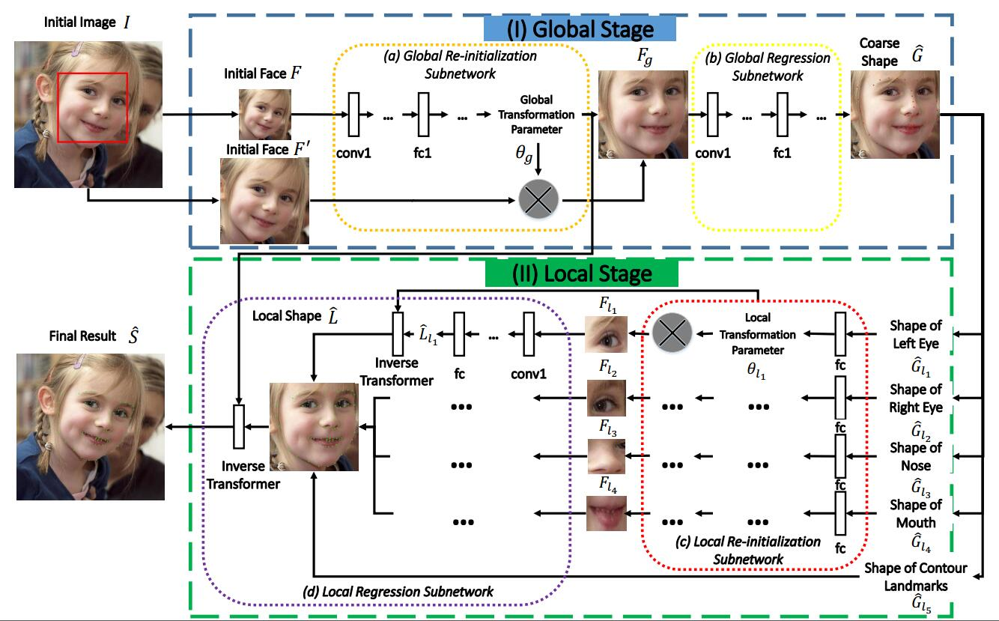
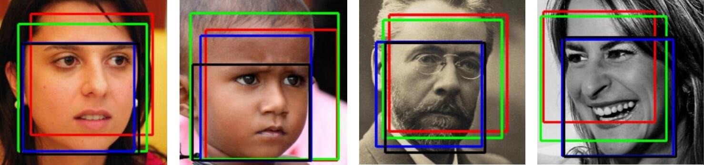
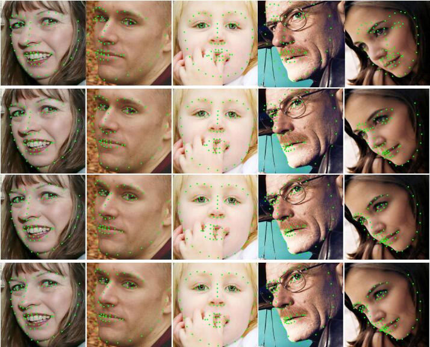
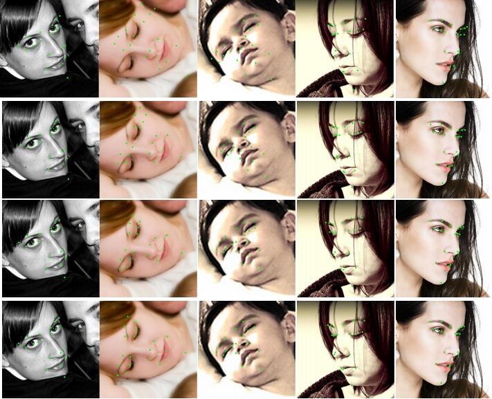

# Face-Alignment-with-Two-Stage-Re-initialization
The test code of the CVPR 2017 paper "A Deep Regression Architecture with Two-Stage Re-initialization for High Performance Facial Landmark Detection"



## Requirement
  1. general environment for Caffe platform on Linux OS: https://github.com/BVLC/caffe. 
  2. Matlab 2013a or later
  3. Cuda (if use nvidia gpu)

## Introduction
   
    Since different face detectors often return various face bounding boxes with different scales and center shifts, it would be
very useful if a facial landmark detection algorithm can produce robust results without depending so much on the face detection results. To explicitly deal with the initialization problem in regression based landmark detection methods, we present a deep regression  architecture with two-stage re-initialization learned from end to end. Our proposed deep architecture is trained
from end to end and obtains promising results using different kinds of unstable initialization. It also achieves superior
performances over many competing algorithms.
   
  The comparison of our method and other baseline mehods on 300-W and AFLW dataset are shown as follows, more details can be found in the initial paper.
   
   
   
## Run the test code
   The models are saved at Baidu SkyDrive, the 
   When you had successfully built the CAFFE in this project and downloaded the models, just run the main_300w_part.m and main_aflw_part.m in the demo folder.
   
  
### Acknowledgement
  The source code of st_layer.cpp and st_layer.cu come from [here](https://github.com/christopher5106/last_caffe_with_stn).
### Citation
```
If you find this work useful, please cite as follows:
  @inproceedings{lv2017twostage,  
  title={A Deep Regression Architecture with Two-Stage Re-initialization for High Performance Facial Landmark Detection},  
  author={Lv, Jiangjing and Shao, Xiaohu and Xing, Junliang and Cheng, Cheng and Zhou, Xi},  
  booktitle={Proceedings of the IEEE conference on computer vision and pattern recognition},  
  year={2017}  
 }
```
 
 
